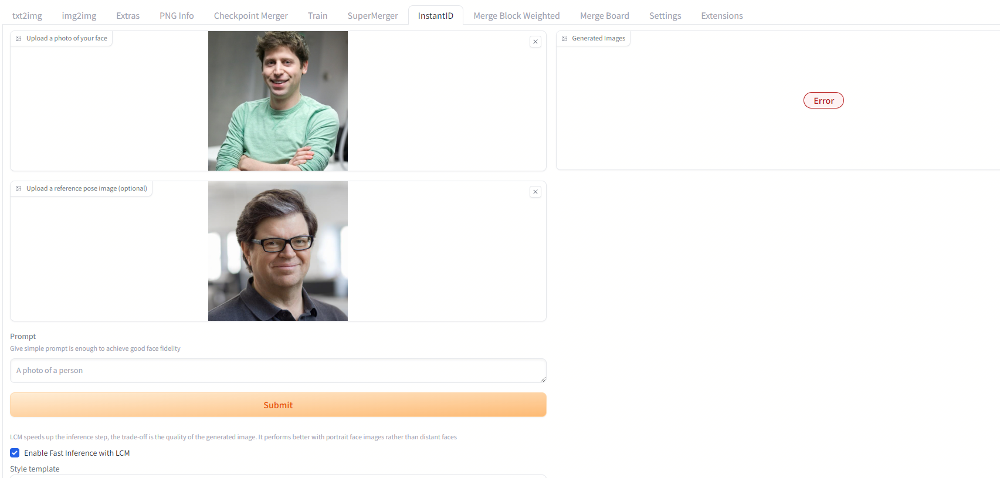

# sd_webui_ZeST

Extension for [webui](https://github.com/AUTOMATIC1111/stable-diffusion-webui). This is a ZeST to image demo using diffusers and the [gradio library](https://github.com/gradio-app/gradio). 

Find the UI for ZeST in the Extras tab after installing the extension.

# Installation
Install from webui's Extensions tab.

# Credits

* ZeST library that does all the work: https://github.com/ttchengab/zest_code

